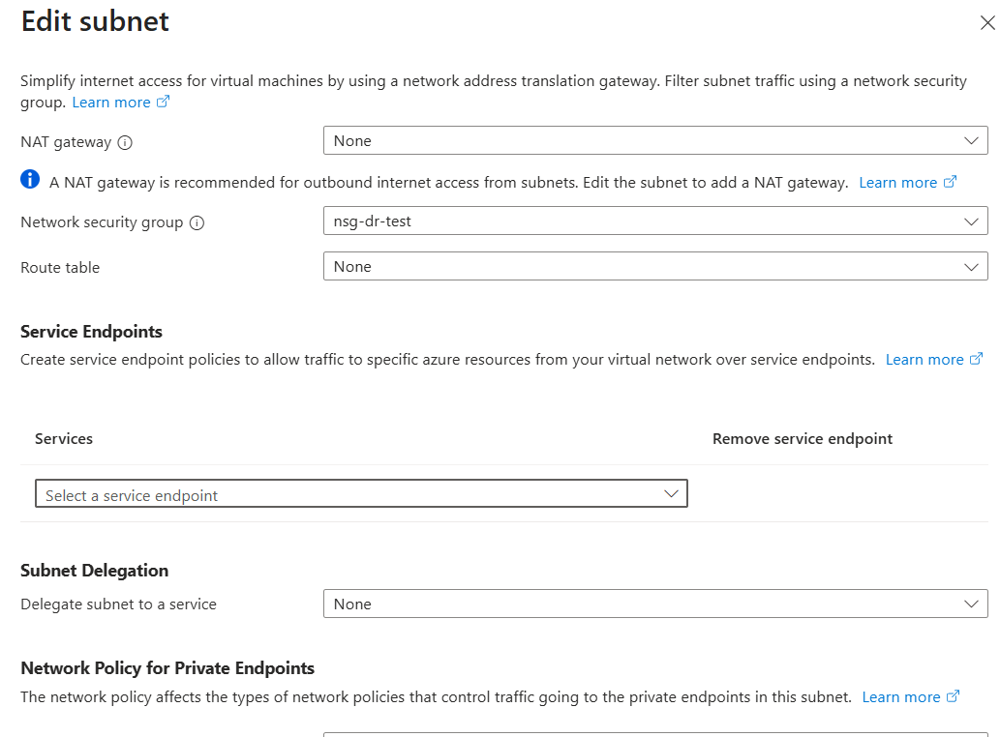

# **Hybrid Connectivity and Disaster Recovery (DR) Project**

## **Project Goal**

Design, implement, and secure a hybrid cloud environment for a small/medium business, focusing on robust data protection through Azure Backup (BDR) and business continuity via Azure Site Recovery (DR). This project validates cross-VNet connectivity and the recovery process for a Windows Server Virtual Machine.

## **1\. Environment Overview**

| Component | Production VNet (Source) | DR VNet (Target) | Status |
| :---- | :---- | :---- | :---- |
| **Region** | (e.g., East US) | (e.g., West US 2\) | Established |
| **VNet CIDR** | VNet-Prod (10.1.0.0/16) | VNet-DR (10.2.0.0/16) | Established |
| **Production VM** | VM-Web-Prod | N/A | Source of Replication |
| **Test Failover VM** | N/A | VM-Web-Prod-test (IP: 10.2.1.4) | Successfully Tested |
| **Recovery Services Vault** | **RSV** (East US) | **RSV** (East US) | Central hub for DR/BDR |
| **Target Resource Group** | RG-Prod | RG-Prod-asr | Target for replicated resources |

## **2\. Networking and Security (Key Task: Networking, Security)**

### **2.1. VNet Peering**

VNet Peering establishes the non-internet-based route for private communication between the Production and DR regions.

* **Peering Name:** dr-prod-peer  
* **Status:** **Connected** and **Fully Synchronized**   
* **Configuration:** VNet Peering was configured bidirectionally to ensure full connectivity.

### **2.2. Network Security Groups (NSGs)**

NSGs were configured to restrict traffic, ensuring only necessary management ports are open, and only to specific source networks.

* **Target NSG:** nsg-dr-test (Attached to DR Subnet/NIC)   
* **Security Fix (Critical):** An inbound rule was required to allow RDP from the Production VNet's CIDR (10.1.0.0/16) to the DR VNet.  
  * **Rule:** inboundRDP-from-prod (Priority 100\)  
  * **Source:** 10.1.0.0/16  
  * **Destination:** 10.2.0.0/16 (Or the NIC's IP)  
  * **Port:** 3389 (TCP)  
  * **Action:** Allow 

## **3\. Compute and Secure Access (Key Task: Compute, Security)**

### **3.1. Virtual Machines (VMs)**

Deployed a Windows Server VM (VM-Web-Prod) as the source for the DR protection.

### **3.2. Azure Bastion**

Azure Bastion secures access to the VMs, replacing exposed public RDP/SSH ports.

* **Function:** Provides secure, browser-based RDP/SSH connectivity over SSL/TLS.  
* **Role in Project:** Essential for out-of-band management and troubleshooting the Test Failover VM when VNet RDP failed, allowing direct access to run configuration commands.

## **4\. Data Protection: Backup and Disaster Recovery (Key Task: Data Protection)**

Data protection is achieved using two distinct but complementary services within the **Recovery Services Vault (RSV)**.

### **4.1. Azure Backup (BDR)**

* **Purpose:** Provides **point-in-time, long-term** data protection for recovery from data corruption or accidental deletion. Focused on **data recovery**.  
* **Mechanism:** Snapshot-based backups are stored in the RSV's highly durable storage based on a defined policy (e.g., daily).

### **4.2. Azure Site Recovery (ASR) \- DR**

* **Purpose:** Provides **near-real-time continuous replication** of the VM to the DR region, enabling fast recovery for **business continuity**.  
* **Mechanism:** Uses a Cache Storage to manage write churn and sends data to the target replica disks. Designed for low Recovery Point Objective (RPO) and Recovery Time Objective (RTO).

## **5\. Storage and Lifecycle Management (Key Task: Storage, Data Protection)**

### **5.1. Storage Accounts and Tiers**

* **Production Storage:** Uses Azure Managed Disks for the source VM.  
* **Cache Storage (Source Region):** A temporary Standard Storage account is used as a high-performance buffer to handle data changes (churn) from the source VM before they are transmitted to the target region.  
* **Target Replication Storage (DR Region):** ASR manages the replica of the Managed Disks in the target resource group (RG-Prod-asr).

### **5.2. Lifecycle Management Policy**

* **ASR Replication Policy:** This policy dictates the retention period for recovery points (snapshots of the replicated VM disk). This is a critical factor for both RPO and storage cost management.

## **6\. Documented Test Failover Analysis and Resolution**

The first Test Failover was a success on the network and infrastructure layers but failed on the application layer, requiring the following troubleshooting steps:

| Issue | Initial Symptom | Resolution Applied | Confirmed Root Cause |
| :---- | :---- | :---- | :---- |
| **Connectivity** | RDP Timed out (before NSG fix). | Added inboundRDP-from-prod NSG rule. | **Missing NSG Rule** on DR VNet. |
| **Authentication (NLA)** | "The logon attempt failed" after NSG fix. | Disabled NLA via REG ADD command run via Bastion. | **Strict NLA Setting** blocking the connection. |
| **Authentication (User)** | "The logon attempt failed" (after NLA fix). | Used simple username (azureuser) \!\[Successful Local User Login\](images/Screenshot 2025-11-11 123425.png) | **Incorrect User Format** (domain prefix used in error) \!\[Failing RDP Login with Domain Prefix\](images/Screenshot 2025-11-11 122435.png) |
| **Residual Failure** | "The logon attempt failed" (after all fixes). | **Action:** Initiate Test Failover Cleanup. | **Confirmed Final Cause:** Unrecoverable **corrupt local user profile** on the Test VM (an intermittent ASR issue). |

### **Conclusion**

The Test Failover validation identified and resolved critical networking, security, and authentication issues. The final, persistent authentication error requires a **Test Failover Cleanup** and a re-run using an older recovery point to ensure a successful final validation.

